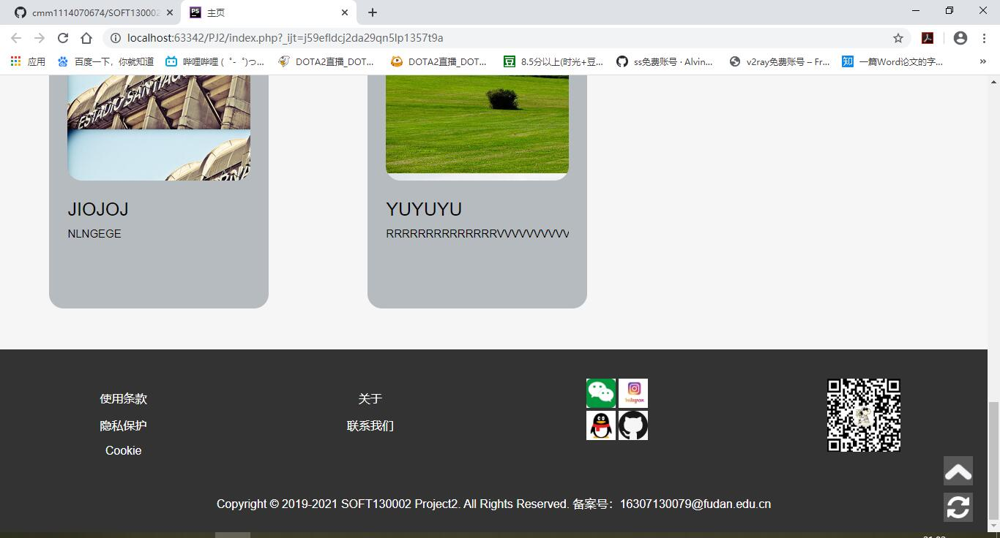
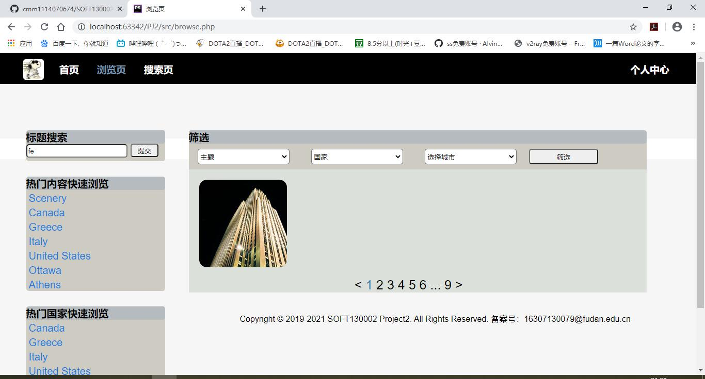

PJ2说明文档
==========
16307130079 曹铭明

-------------------

## Github 地址

Github 地址:https://github.com/cmm1114070674/SOFT130002_PJ2

-------------------

## 项目完成情况

项目基本完成，除了少量难点没有解决，其他功能都已经实现，并且对每个界面都进行过调试，并对数据库内容对比查看，满足项目的需求。

-------------------

## 项目效果图

如下：

登录前主页显示效果

登录后主页显示效果

开始显示为收藏最多的图片，刷新后变为随机图片

浏览页搜索后显示搜索结果图片

点击热门内容展现对应图片

使用筛选框显示筛选结果图片

搜索页对标题筛选后显示按标题搜索结果图片

搜索页对描述筛选后显示按描述搜索结果图片

上传页修改为按主题、国家、城市的联动添加方式

填写完成图片信息后添加后跳转到对应图片详情页面

图片详情页面点击收藏后收藏人数和收藏按钮变化

我的照片页面显示照片信息

点击修改后进入上传页面，但此时有图片已有信息的显示

我的照片页面点击删除后将删除照片，当没有我的照片时显示文字信息

我的收藏页面没有收藏照片时显示文字信息

我的收藏页面存在收藏图片时，显示图片信息，点击删除会取消收藏但不会删除图片

登录页面如图所示，当登录信息不正确时跳出提示信息

注册页面如图所示，当注册信息不符合要求时显示提示信息

当注册用户存在时，跳出提示信息

用户未登录时，无法进入上传、我的照片、我的收藏页面，图片详情页面不显示收藏按钮

-----------------

## Bonus的完成情况和解决⽅法

Bonus中完成了哈希加盐功能，秘密在数据库显示加密

实现方式和效果如下

-----------------

## 对 PJ 2 和本⻔课程的意⻅和建议

对这门课感觉很满意，没有太多要改变的地方，网上视频的形式也很好保证了学习效果，让自己能对不理解的地方反复学习。

PJ2的话也很好，确保了php的学习和回顾，任务量也适中，很符合课程要求。
